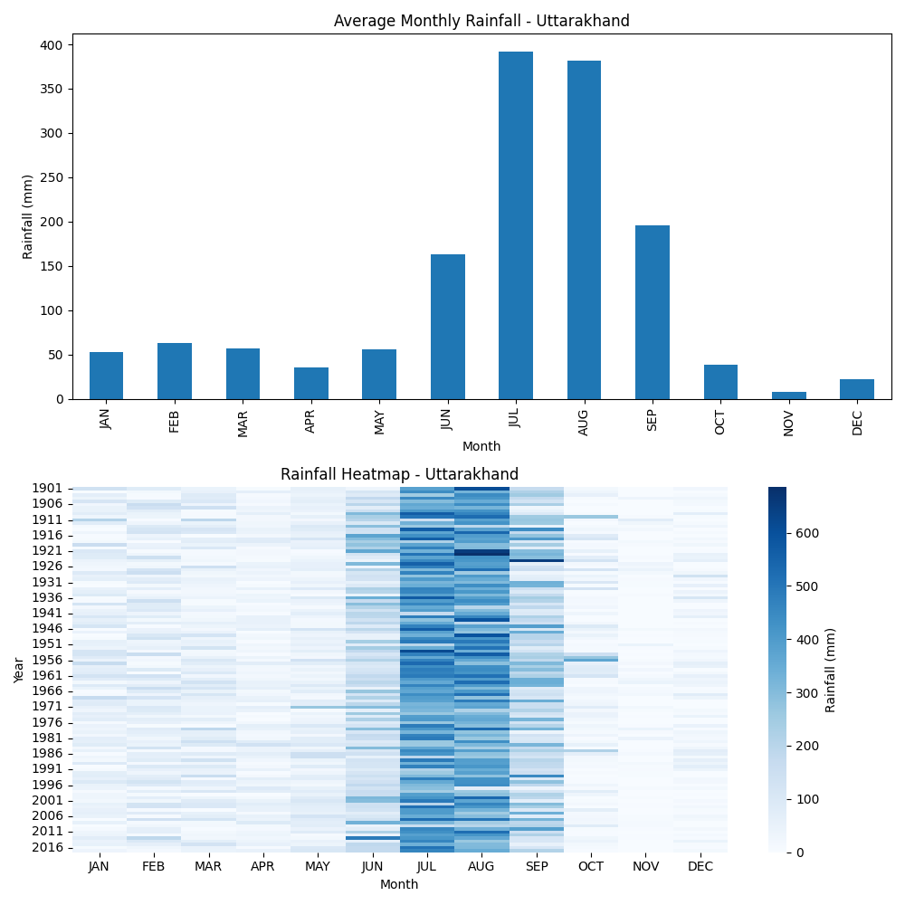

# Uttarakhand Rainfall Analysis

## Project Overview

This project analyzes historical rainfall data for **Uttarakhand** to understand rainfall patterns and identify periods of extreme rainfall that may increase landslide risk.

The script processes rainfall data, calculates monthly averages, detects extreme rainfall events, and visualizes rainfall patterns using charts and heatmaps.

The goal of the project is to explore seasonal rainfall trends and highlight months or years with unusually high rainfall.

---

## Dataset

The dataset contains historical rainfall data for Uttarakhand.

Columns included in the dataset:

- Year
- JAN
- FEB
- MAR
- APR
- MAY
- JUN
- JUL
- AUG
- SEP
- OCT
- NOV
- DEC
- Annual
- JF
- MAM
- JJAS
- OND

All rainfall values are measured in **millimeters (mm)**.

---

## Libraries Used

The project uses the following Python libraries:

- pandas → data processing and analysis
- matplotlib → data visualization
- seaborn → heatmap visualization

---

## Analysis Workflow

The script performs the following steps:

1. Load rainfall dataset using **pandas**
2. Extract monthly rainfall columns (January–December)
3. Calculate **average rainfall for each month**
4. Detect **extreme rainfall events (>200 mm)**
5. Estimate **landslide risk levels** based on rainfall intensity
6. Calculate **total annual rainfall**
7. Identify **years with the highest rainfall**
8. Generate rainfall visualizations

---

## Visualizations

The project generates two main visualizations:

### Average Monthly Rainfall

A bar chart showing the **average rainfall for each month**.

### Rainfall Heatmap

A heatmap showing rainfall intensity across **years and months**.

### Visualization Output



---

## Project Structure

```
uttarakhand-rainfall-analysis
│
├── data
│   └── rainfall_uttarakhand.csv
│
├── outputs
│   └── rainfall_visualizations.png
│
├── src
│   └── rainfall_analysis.py
│
├── requirements.txt
└── README.md
```

---

## How to Run the Project

Clone the repository:

```
git clone https://github.com/dograsarishty367-afk/uttarakhand-rainfall-analysis.git
```

Move into the project directory:

```
cd uttarakhand-rainfall-analysis
```

Install required libraries:

```
pip install -r requirements.txt
```

Run the analysis script:

```
python src/rainfall_analysis.py
```

---

## Author

Sarishty Dogra
